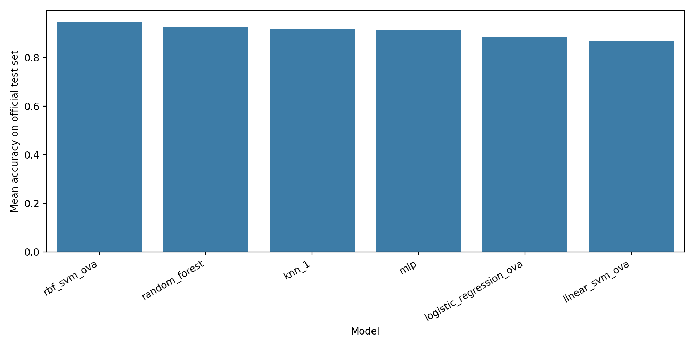
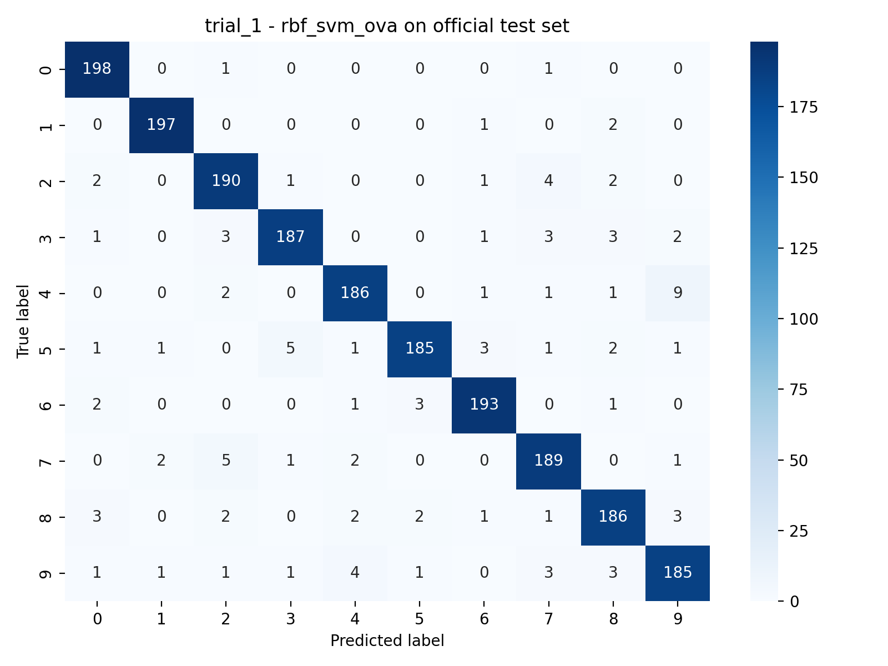

# Handwritten Digit Classification Under the CS5487 Protocol

**Authors:** Sun Baozheng; Zhang Yuxuan

**Contribution statement:** Sun Baozheng and Zhang Yuxuan contributed equally. Both members participated in method design, experiment implementation, result verification, and report writing.

## Abstract

This project studies ten-class handwritten digit classification on the default CS5487 digits4000 dataset. We compare six supervised classifiers under the two official writer-disjoint train/test trials: 1-NN, one-vs-all logistic regression, one-vs-all linear SVM, one-vs-all RBF SVM, Random Forest, and MLP. All model selection is done with five-fold cross-validation inside the training split only. The strongest official-test result is obtained by the raw-pixel RBF SVM, with mean accuracy 94.73% across the two trials, improving over the 1-NN baseline by 3.12 percentage points. The main analysis result is that preprocessing is model-dependent: scaling helps optimization-based models, PCA helps the linear SVM, while the strongest nonlinear models preserve more useful local shape information when trained on raw pixels.

## 1. Introduction

The problem is to classify each 28 x 28 grayscale digit image into one of ten classes. Although this is a standard supervised learning task, it is a useful test of model choice because the input is a fixed 784-dimensional pixel vector rather than a hand-designed feature representation. A good classifier must therefore separate visually similar digits while staying robust to writer-specific variation such as stroke thickness, slant, incomplete loops, and small shifts.

This problem is important for the course project because it connects several supervised learning ideas in one controlled setting. The labels are simple, but the feature space is high-dimensional and the decision boundary is not obviously linear. A method can perform well only if its assumptions match the geometry of handwritten digits: some classes are separated by broad global shape, while others depend on small local details such as whether a loop closes or a short stroke attaches to the rest of the digit.

The project proposal set three goals: improve over the course 1-NN baseline, test whether preprocessing improves generalization, and analyze which models fail on visually similar classes. The final experiment keeps those goals but expands the comparison with Random Forest and MLP as additional nonlinear baselines. This gives a controlled comparison between local-neighbor, linear, kernel, tree-ensemble, and neural-network methods under the same official protocol.

The report therefore treats accuracy as only the first layer of evidence. The stronger question is why one model wins, whether the result is stable across both trials, and whether the same failure patterns appear in confusion matrices, per-class recall, and representative examples. This avoids drawing a conclusion from a single aggregate number.

## 2. Methodology

The data are the provided digits4000 files. The feature matrix contains 4000 samples, each with 784 grayscale pixel values in [0, 255], and the labels cover digits 0 through 9 with 400 samples per class. The official index files define two trials, each with 2000 training samples and 2000 test samples. The same writer does not appear in both train and test within a trial, so the test accuracy measures writer-level generalization rather than memorization of a writer's style.

The writer-disjoint split is stricter than a random image split. If the same writer appeared in both train and test, a classifier could benefit from writer-specific stroke style, pen pressure, or centering habits. Under the official split, the model must instead learn class structure that transfers to different writers.

All preprocessing is implemented inside a scikit-learn Pipeline, so scalers and PCA components are fit only on the training fold during cross-validation. The searched preprocessing variants are raw pixels, min-max scaling to [0, 1], z-score standardization, and z-score standardization followed by PCA to 50, 100, or 150 dimensions. This design prevents test-set leakage and makes each model/preprocessing combination directly comparable.

The classifiers cover the methods proposed at the start of the project plus two additional baselines. 1-NN is a strong local baseline with almost no training cost, but it is sensitive to irrelevant pixel-space variation. Logistic regression and linear SVM provide interpretable linear one-vs-all baselines, but they can only create global linear decision surfaces. The RBF SVM uses the same one-vs-all strategy but adds a nonlinear kernel, allowing curved class boundaries. Random Forest gives a tree-ensemble alternative that is insensitive to monotonic scaling. MLP tests whether a compact neural network can beat classical methods on the same fixed pixel vectors.

The advantages and disadvantages are different for each family. 1-NN is transparent and has no training phase, but it stores all training samples and can be distorted by irrelevant pixel directions. Logistic regression is fast and gives well-behaved linear scores, while linear SVM uses a large-margin objective; both are limited by global linear boundaries. RBF SVM, Random Forest, and MLP are more expressive, but require more careful tuning and have higher model-selection cost.

### 2.3 OvA Decision Logic

All OvA models in this project use sklearn OneVsRestClassifier with its default prediction behavior. At inference time, the final class is selected by the largest per-class decision score, following the library default implementation. No custom tie-breaking or post-hoc calibration rule is added beyond this default OvA decision logic.

## 3. Experimental Setup

For each trial, each model/preprocessing candidate is selected using GridSearchCV with five stratified folds and accuracy as the validation metric. The selected pipeline is then refit on the full training split and evaluated once on the official test split. Challenge digits are evaluated only after this selection step by reusing the same fitted pipeline, without retraining or parameter changes.

This separation is the main technical control in the experiment. The training split is the only source used for model selection, including scaler fitting, PCA fitting, and hyperparameter comparison. The official test split is not used to choose C, gamma, PCA dimension, tree count, learning rate, or any other setting.

The hyperparameter grids are intentionally broad enough to test interesting settings while remaining reproducible. Logistic regression searches C in {1e-4, 1e-3, 1e-2, 0.1, 1, 10, 100, 1000, 1e4} with L2 penalty. Linear SVM searches the same C values and both unweighted and balanced class weights. RBF SVM searches C in {0.1, 1, 10, 100} and gamma in {scale, 1e-4, 3e-4, 1e-3, 3e-3, 1e-2}. Random Forest searches 300 or 600 trees, depth None, 20, or 40, max_features sqrt or 0.5, and min_samples_leaf 1 or 2. MLP searches one or two hidden layers, alpha in {1e-4, 5e-4, 1e-3}, and learning_rate_init in {5e-4, 1e-3, 5e-3}.

The main metric is official-test accuracy, reported separately for trial 1 and trial 2 and as mean plus standard deviation across trials. Macro-F1 and per-class recall are used to check whether a model improves broadly across classes. Confusion matrices and representative case examples are used for failure analysis.

The long-running experiment was split into light and heavy batches on Tencent Cloud and then combined into the canonical artifacts folder. The light batch contains 1-NN, logistic regression, and linear SVM; the heavy batch contains RBF SVM, Random Forest, and MLP. Combining the batches only merges saved artifacts and does not change selected hyperparameters.

## 4. Experimental Results

Table 1 reports the official-test results after combining the light and heavy batches.

| Model | Selected preprocessing | Trial 1 acc. | Trial 2 acc. | Mean acc. | Std. | Mean macro-F1 |
| --- | --- | --- | --- | --- | --- | --- |
| RBF SVM OvA | raw / raw | 94.80% | 94.65% | 94.73% | 0.11% | 0.9471 |
| Random Forest | raw / raw | 92.95% | 92.40% | 92.67% | 0.39% | 0.9266 |
| 1-NN | raw / raw | 91.35% | 91.85% | 91.60% | 0.35% | 0.9155 |
| MLP | minmax / minmax | 92.00% | 90.40% | 91.20% | 1.13% | 0.9120 |
| Logistic Regression OvA | minmax / minmax | 89.05% | 87.85% | 88.45% | 0.85% | 0.8836 |
| Linear SVM OvA | pca_50 / pca_100 | 87.65% | 85.80% | 86.72% | 1.31% | 0.8661 |

The RBF SVM is the best model with mean official-test accuracy 94.73%. It improves on the 1-NN baseline (91.60%) by 3.12 percentage points. Random Forest is the second-best model and is clearly above 1-NN, while the MLP is close to the nearest-neighbor baseline but less stable across trials. Logistic regression and linear SVM are much weaker, showing that a single linear decision boundary is not expressive enough for the hardest digit shapes.

The ranking is meaningful because every model used the same trial definitions and training-only selection rule. The gap between RBF SVM and 1-NN reflects the RBF kernel's ability to compare images through nonlinear local neighborhoods instead of relying only on raw Euclidean nearest-neighbor distance.

Table 2 adds the per-trial selections and average model-selection runtime.

| Model | Trial 1 prep. | Trial 1 acc. | Trial 2 prep. | Trial 2 acc. | Mean runtime (s) |
| --- | --- | --- | --- | --- | --- |
| RBF SVM OvA | raw | 94.80% | raw | 94.65% | 67.2 |
| Random Forest | raw | 92.95% | raw | 92.40% | 192.3 |
| 1-NN | raw | 91.35% | raw | 91.85% | 4.0 |
| MLP | minmax | 92.00% | minmax | 90.40% | 35.7 |
| Logistic Regression OvA | minmax | 89.05% | minmax | 87.85% | 39.9 |
| Linear SVM OvA | pca_50 | 87.65% | pca_100 | 85.80% | 184.6 |

The RBF SVM is also stable: its two official-test accuracies differ by only 0.15 percentage points. MLP varies more (1.60 points), and the linear SVM is both the slowest and weakest model, taking about 184.6 seconds per trial compared with 67.2 seconds for the RBF SVM.

Runtime changes the practical interpretation. 1-NN is the cheapest baseline, but the RBF SVM gives a much higher accuracy at a still reasonable search cost. Linear SVM is the least attractive trade-off because it is slow in this grid and still produces the weakest official-test performance.

### 4.1 Preprocessing Effects

Table 3 shows representative cross-validation averages for preprocessing choices.

| Model | Preprocessing | Mean best CV acc. | Selected trials |
| --- | --- | --- | --- |
| 1-NN | raw | 92.10% | 2/2 |
| 1-NN | minmax | 92.10% | 0/2 |
| Logistic Regression OvA | minmax | 89.03% | 2/2 |
| Logistic Regression OvA | raw | 86.75% | 0/2 |
| Linear SVM OvA | pca_100 | 87.83% | 1/2 |
| Linear SVM OvA | raw | 84.15% | 0/2 |
| RBF SVM OvA | raw | 94.47% | 2/2 |
| RBF SVM OvA | pca_100 | 92.53% | 0/2 |
| Random Forest | raw | 92.27% | 2/2 |
| Random Forest | pca_100 | 90.15% | 0/2 |
| MLP | minmax | 91.90% | 2/2 |
| MLP | zscore | 90.48% | 0/2 |

The preprocessing pattern is consistent across trials. Raw pixels are selected by 1-NN, RBF SVM, and Random Forest. Min-max scaling is selected by logistic regression and MLP. PCA is selected by the linear SVM, with pca_50 in trial 1 and pca_100 in trial 2. This supports the main representation claim: scaling helps optimization-sensitive models, PCA helps the linear margin by denoising the feature space, and raw pixels preserve the local stroke details needed by the strongest nonlinear models.

The direction of the preprocessing effect depends on the classifier. Logistic regression improves from 86.75% mean best CV accuracy on raw pixels to 89.03% with min-max scaling. Linear SVM improves from 84.15% on raw pixels to 87.83% with pca_100. In contrast, RBF SVM and Random Forest both lose performance under PCA, suggesting that dimensionality reduction removes useful local stroke information.

### 4.2 Confusion and Case Analysis

The best model's remaining errors are concentrated in visually plausible pairs. In trial 1, the largest RBF SVM confusions are 4->9 (9 cases), 7->2 (5), 5->3 (5), 9->4 (4), and 2->7 (4). In trial 2, the largest are 5->3 (5), 9->4 (5), 5->6 (5), 8->9 (4), and 4->9 (4). These pairs are not random: they correspond to loop closure, stroke attachment, and local curvature differences.

Per-class recall reinforces the same interpretation. For RBF SVM, digits 0, 1, and 6 are among the easiest classes in both trials, with recalls near or above 0.97 in most cases. The weakest recall in trial 2 is digit 5 at 0.895, followed by digit 2 at 0.915 and digits 8 and 9 at 0.930. These are exactly the classes involved in the largest confusion pairs.

No digit has average recall below 0.90 under the selected RBF SVM. Digit 5 is the hardest because it can look like 3 when the lower curve is rounded and like 6 when the lower loop closes. The linear SVM makes the same types of mistakes in larger numbers, which indicates that the issue is model flexibility rather than random label noise.

The representative case table makes this concrete. Trial 1 failures include samples 2826 and 2872 as 4->9, samples 3045 and 3123 as 5->3, and samples 3414 and 3433 as 7->2. The success examples come from digits 0, 1, and 6, matching the high-recall classes. The same pattern appears in trial 2, where the top failure groups are 5->6, 5->3, and 9->4. The linear SVM has the same kinds of mistakes but in larger numbers, such as 5->3 (16 cases) and 9->7 (13) in trial 1, which explains its lower accuracy.

## 5. Discussion

The main transferable finding is that preprocessing is classifier-family dependent rather than universally beneficial. Results in final_selected_models.csv and preprocessing_tradeoff_summary.csv show a consistent split: raw pixels are selected for 1-NN, RBF SVM, and Random Forest, while min-max scaling is selected for logistic regression and MLP, and PCA is selected for linear SVM. This indicates that preprocessing should be treated as part of model design, not as a fixed default pipeline.

The RBF SVM advantage comes from boundary shape, not only from a higher average score. According to summary_by_model.csv, RBF SVM reaches 0.9473 mean official-test accuracy, while linear SVM reaches 0.8673. The confusion analysis in Section 4 shows that difficult pairs such as 4/9, 5/3, and 2/7 differ by local stroke attachment and loop closure details that are hard to separate with one-vs-all linear hyperplanes. The RBF kernel models these local nonlinear transitions more effectively in pixel space.

Across non-kernel alternatives, Random Forest is the strongest backup while MLP is competitive but less stable. summary_by_model.csv reports Random Forest at 0.9268 official-test mean and 0.7033 challenge mean, both above the 1-NN baseline (0.9160 and 0.6833). MLP reaches 0.9120 on the official test but has larger cross-trial variation (std 0.0113) and lower challenge robustness (0.6633). Together with model_tradeoff_summary.csv runtime evidence, this supports a practical ranking: RBF SVM for best overall accuracy, Random Forest for robust second-best performance, and 1-NN for low-cost baseline deployment.

A key limitation is that the official evaluation uses only two writer-disjoint trials, so uncertainty estimates are still coarse for broader handwriting domains. A direct future action is to add repeated writer-disjoint resampling or nested repeated CV before model lock-in, while preserving the same rule that challenge data is used only after model selection.

## 6. Private Challenge Evaluation

The challenge results are included here for the instructor-facing written report, but they should not be copied into public presentation or poster material. The challenge set contains 150 handwritten digits and is evaluated only by applying each trial's already selected pipeline.

| Model | Mean challenge acc. | Std. | Delta vs. 0.683 reference |
| --- | --- | --- | --- |
| RBF SVM OvA | 75.67% | 4.24% | +7.37 pp |
| Random Forest | 70.33% | 2.36% | +2.03 pp |
| 1-NN | 68.33% | 3.30% | +0.03 pp |
| MLP | 66.33% | 0.47% | -1.97 pp |
| Logistic Regression OvA | 62.67% | 0.00% | -5.63 pp |
| Linear SVM OvA | 54.33% | 0.47% | -13.97 pp |

The challenge ranking broadly matches the official-test ranking: RBF SVM remains best, Random Forest remains second, and the linear SVM remains last. All methods drop substantially relative to the official test split, which indicates a domain shift in handwriting style. The RBF SVM still beats the 0.683 reference by 7.37 percentage points, while MLP falls below the nearest-neighbor reference despite being competitive on the official test set.

The challenge drop is expected because the challenge digits come from a different handwriting source. The official test accuracy measures generalization to held-out writers inside the course dataset, while the challenge accuracy measures an additional distribution shift. This is why the absolute numbers are lower even though the ranking remains broadly similar.

## 7. Conclusion

The final answer to the project question is that a one-vs-all RBF SVM trained on raw pixels gives the best overall result under the CS5487 protocol. It is accurate, stable across the two writer-disjoint trials, and more robust on the challenge set than the other tested methods. Random Forest is a useful extra baseline and the second-best official-test model. The linear methods are useful diagnostically because they show why preprocessing matters, but their accuracy is limited by the complexity of the digit boundaries.

The strongest scientific observation is not simply that one model wins. The experiments show that feature processing and classifier family interact. Min-max scaling is helpful for logistic regression and MLP, PCA is helpful for the linear SVM, and raw pixels are best for 1-NN, RBF SVM, and Random Forest. The remaining errors are concentrated in shape-based digit pairs such as 4/9, 5/3, 5/6, 7/2, and 8/9.

The main limitation is that the experiment uses fixed vectorized pixels rather than richer image features. More advanced image processing, deskewing, centering correction, or convolutional models could plausibly improve the hardest classes. Within the intended course setting, the current experiment isolates how classical classifiers and preprocessing choices behave under the same protocol.

## 8. Third-Party Acknowledgements

The implementation uses standard Python libraries: NumPy and pandas for data handling, scikit-learn for modeling and cross-validation, matplotlib and seaborn for experiment figures, joblib for saved pipelines, Pillow for case visualizations, and python-docx for report export. No external training code or pretrained models were copied into the experiment pipeline.
