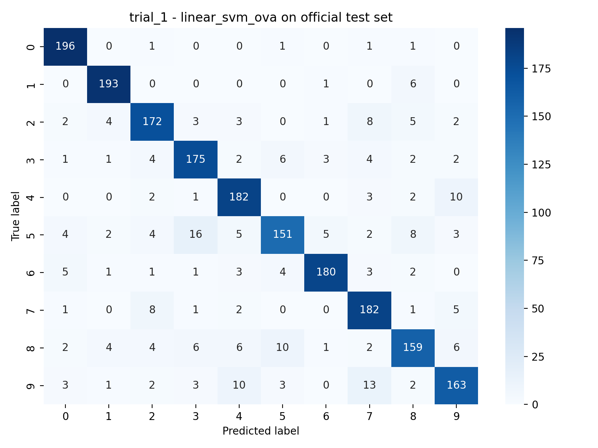

# CS5487 Course Project Report

## Title

Handwritten Digit Classification Under the CS5487 Protocol: Comparing Linear, Kernel, Tree, and Neural Models

## Authors

- Sun Baozheng
- Zhang Yuxuan

## Contribution Statement

Contribution split to be finalized after both authors confirm the exact division of work.

## 1. Introduction

This project studies handwritten digit classification on the default CS5487 course dataset using the official `digits4000` protocol. The dataset represents each digit as a 784-dimensional grayscale vector, so the central question is not only which classifier works best, but also which preprocessing pipeline preserves the most useful structure in this fixed pixel representation.

The original proposal focused on improving over the provided 1-nearest-neighbor baseline and understanding the trade-off between accuracy and robustness. To answer that question, we compare six model families: 1-NN, one-vs-all logistic regression, one-vs-all linear SVM, one-vs-all RBF SVM, Random Forest, and MLP. The comparison is deliberately controlled. Every model is trained under the same two official trials, uses the same training-only model-selection protocol, and is evaluated on the same official test split before any private challenge evaluation is considered.

The main outcome is clear. The strongest model on the official test set is the one-vs-all RBF SVM with raw pixels, which reaches a mean official-test accuracy of 0.9470 across the two trials. Random Forest is the second-best method at 0.9255, while the original 1-NN baseline remains a competitive reference at 0.9160. The weaker results from logistic regression and linear SVM also make the preprocessing story clearer: scaling and PCA help linear decision boundaries substantially, but the strongest nonlinear models prefer to keep the original pixel geometry.

## 2. Methodology

### 2.1 Dataset and Protocol

The implementation loads two datasets. The main `digits4000` dataset contains 4000 labeled digit samples with 784 features each, covering classes 0 to 9. The course challenge dataset contains 150 additional labeled digits in the same feature format. The code validates these shapes explicitly before any training starts.

The official protocol provides two fixed train/test trials through index files. In each trial, 2000 samples are used for training and 2000 for official testing. The indices are converted from the provided 1-based text format into 0-based Python indices, and the loader checks that the train and test partitions do not overlap.

Model selection is performed strictly inside the training split. For every trial and every model/preprocessing combination, the code runs 5-fold stratified cross-validation on the training portion only. After the best configuration is chosen, the fitted pipeline is evaluated on the official test split. Only then is the same saved pipeline reused on the 150 challenge digits. The challenge protocol is therefore respected exactly: no retraining and no post-hoc parameter changes are allowed after selection on the official split.

### 2.2 Preprocessing Pipelines

The project searches the following preprocessing options:

- `raw`: no scaling or dimensionality reduction
- `minmax`: min-max scaling to `[0, 1]`
- `zscore`: standardization to zero mean and unit variance
- `pca_50`, `pca_100`, `pca_150`: z-score scaling followed by PCA to 50, 100, or 150 components

All preprocessing is placed inside one shared scikit-learn `Pipeline`. This design matters for two reasons. First, it avoids duplicated model-selection code across different classifiers. Second, it prevents information leakage: the scaler and PCA transformation are fitted only on the training folds inside cross-validation, then applied to the validation fold or test data through the fitted pipeline.

These options were chosen to test two hypotheses. Scaling may help optimization-based linear models by normalizing feature magnitudes. PCA may help when the raw 784-dimensional representation contains redundant or noisy directions, especially for models that depend on a single global separating boundary. At the same time, PCA may hurt methods that rely on local geometric detail in the original pixel space.

### 2.3 In-Class Classifiers

The report includes the four classifier families most directly aligned with the course material.

`1-NN` uses Euclidean distance with `k = 1`. It has no model-parameter search grid, so the only selection question is the preprocessing pipeline. Its main strength is simplicity and a strong local baseline. Its main weakness is sensitivity to irrelevant variation in the raw feature space.

`One-vs-all logistic regression` trains ten binary classifiers through `OneVsRestClassifier(LogisticRegression)`, using the `liblinear` solver and `max_iter = 2000`. The search grid is `C in {0.1, 1.0, 5.0, 10.0}`. Logistic regression offers a clean linear baseline with probabilistic-style margins, but it is limited when class boundaries are strongly nonlinear in raw pixel space.

`One-vs-all linear SVM` uses `OneVsRestClassifier(LinearSVC)` with `dual = False`, `max_iter = 8000`, and a fixed random seed. The search grid is `C in {0.01, 0.1, 1.0, 5.0, 10.0}`. Linear SVM should outperform logistic regression if a large-margin linear separator is appropriate, but it can still fail when the true class structure depends on curved or localized image patterns.

`One-vs-all RBF SVM` uses `OneVsRestClassifier(SVC(kernel="rbf"))`. The search grid is `C in {1.0, 5.0, 10.0}` and `gamma in {"scale", 0.001, 0.01}`. This model is the strongest nonlinear method in the project because it can represent curved decision boundaries while still operating on the same vectorized input.

For the one-vs-all models, the prediction rule is standard: each binary classifier produces a score for its class, and the class with the highest score is selected.

### 2.4 Extra Classifiers Beyond Class Coverage

To respond to the teacher feedback, the project also evaluates two additional classifiers that are not part of the original in-class comparison set but are still valid on the same 784-dimensional representation.

`Random Forest` provides an ensemble of decision trees with a different form of nonlinearity from SVMs. The search grid is `n_estimators in {200, 400}`, `max_depth in {None, 20}`, and `max_features in {"sqrt", 0.5}`. This model is useful because tree ensembles are insensitive to monotonic rescaling and can capture feature interactions without requiring explicit feature engineering.

`MLP` provides a compact neural-network baseline through `MLPClassifier` with `max_iter = 300`, `early_stopping = True`, and `n_iter_no_change = 15`. The search grid is `hidden_layer_sizes in {(128,), (256,)}`, `alpha in {0.0001, 0.001}`, and `learning_rate_init in {0.001, 0.01}`. It is not part of the original in-class core methods, but it is relevant because it tests whether a shallow neural network can improve over linear models and compete with kernel methods on the same fixed feature vectors.

## 3. Experimental Setup

### 3.1 Hyperparameter Search

All model selection uses `GridSearchCV` with `scoring = accuracy` and `StratifiedKFold(n_splits = 5, shuffle = True, random_state = 5487)`. The runtime configuration keeps `grid_search_jobs = 1` by default to stay stable in local and Colab environments.

The exact search space is summarized below.

| Model | Searched preprocessing | Hyperparameter grid |
| --- | --- | --- |
| 1-NN | raw, minmax, zscore, pca_50, pca_100, pca_150 | none |
| Logistic regression OvA | raw, minmax, zscore, pca_50, pca_100, pca_150 | `C = {0.1, 1.0, 5.0, 10.0}` |
| Linear SVM OvA | raw, zscore, pca_50, pca_100, pca_150 | `C = {0.01, 0.1, 1.0, 5.0, 10.0}` |
| RBF SVM OvA | raw, zscore, pca_50, pca_100, pca_150 | `C = {1.0, 5.0, 10.0}`, `gamma = {scale, 0.001, 0.01}` |
| Random Forest | raw, pca_50, pca_100 | `n_estimators = {200, 400}`, `max_depth = {None, 20}`, `max_features = {sqrt, 0.5}` |
| MLP | minmax, zscore, pca_50, pca_100, pca_150 | `hidden_layer_sizes = {(128,), (256,)}`, `alpha = {0.0001, 0.001}`, `learning_rate_init = {0.001, 0.01}` |

This search design keeps the comparison fair. Every model is allowed to choose from the preprocessing options that make sense for its learning mechanism, but the candidate set is still small enough to be reproducible and interpretable.

### 3.2 Evaluation Metrics

The main public metric is accuracy on the official test split for each trial. The report also tracks macro-F1 and macro-recall to check whether improvements come from broad class-level gains rather than one or two easy digits. For error analysis, the pipeline saves confusion matrices and per-class precision/recall/F1 tables for the official test set.

For the private challenge evaluation, the same selected model from each trial is applied directly to the challenge digits, and the report records challenge accuracy, macro-F1, and macro-recall. These private numbers are kept separate from the public result discussion.

### 3.3 Implementation Details

The project is implemented in Python with `numpy`, `pandas`, `scikit-learn`, `matplotlib`, and `seaborn`, using the local `.venv` environment for the fallback script and a Colab notebook for long-running batch jobs. Results are written to CSV, JSON, PNG, and `joblib` files under `artifacts/`.

The experimental loop uses one shared registry of preprocessors and models, so every trial follows the same code path. After selection, the winning fitted pipeline is saved and then reused on both the official test set and the challenge set. This guarantees that the challenge evaluation is a true post-selection test rather than a second round of tuning.

## 4. Experimental Results

### 4.1 Official Test Results

Table 1 summarizes the main official-test results aggregated across the two trials.

| Rank | Model | Selected preprocessing (trial 1 / trial 2) | Mean accuracy | Std. | Mean macro-F1 |
| --- | --- | --- | ---: | ---: | ---: |
| 1 | RBF SVM OvA | raw / raw | 0.9470 | 0.0014 | 0.9469 |
| 2 | Random Forest | raw / raw | 0.9255 | 0.0049 | 0.9253 |
| 3 | 1-NN | raw / raw | 0.9160 | 0.0035 | 0.9155 |
| 4 | MLP | minmax / minmax | 0.9145 | 0.0106 | 0.9142 |
| 5 | Logistic regression OvA | minmax / minmax | 0.8845 | 0.0085 | 0.8836 |
| 6 | Linear SVM OvA | pca_50 / pca_100 | 0.8673 | 0.0131 | 0.8661 |

The most important result is the gap between the best model and the baseline. The RBF SVM improves the mean official-test accuracy from 0.9160 for 1-NN to 0.9470, an absolute gain of 3.10 percentage points. Random Forest is also clearly stronger than the baseline, but it does not match the RBF SVM. MLP is competitive with 1-NN, yet it does not consistently exceed it. Logistic regression and linear SVM both underperform, which shows that the digit classes are not well separated by a single linear boundary in the original feature space.

The preprocessing pattern is equally informative. The strongest nonlinear models, RBF SVM and Random Forest, both choose raw pixels in both trials. The MLP and logistic regression both prefer min-max scaling in both trials, while the linear SVM needs PCA and never selects raw input. This contrast already suggests that linear and optimization-sensitive models benefit from better-conditioned features, whereas the best nonlinear models prefer to preserve local pixel detail.

Figure 1 gives the same comparison visually.


### 4.2 Per-Trial Results

The per-trial selections in `final_selected_models.csv` show how stable each method is across the two official splits.

| Model | Trial 1 preprocessing | Trial 1 accuracy | Trial 2 preprocessing | Trial 2 accuracy | Model-selection runtime |
| --- | --- | ---: | --- | ---: | --- |
| 1-NN | raw | 0.9135 | raw | 0.9185 | 4.8-7.4 s |
| Logistic regression OvA | minmax | 0.8905 | minmax | 0.8785 | 213.9-223.7 s |
| Linear SVM OvA | pca_50 | 0.8765 | pca_100 | 0.8580 | 4199.1-4227.6 s |
| RBF SVM OvA | raw | 0.9480 | raw | 0.9460 | 980.1-988.8 s |
| Random Forest | raw | 0.9290 | raw | 0.9220 | 1816.9-1849.3 s |
| MLP | minmax | 0.9220 | minmax | 0.9070 | 310.7-322.1 s |

Two observations stand out. First, the RBF SVM is both accurate and stable: the two trial accuracies differ by only 0.002. Random Forest is also fairly stable, with a smaller mean gap than MLP or the linear models. Second, runtime does not align cleanly with accuracy. Linear SVM is the slowest model to select, taking about 4200 seconds per trial, yet it produces the weakest official-test performance. In contrast, logistic regression is much cheaper and slightly stronger, while the RBF SVM delivers the best accuracy at roughly one quarter of the linear-SVM selection time.

This table also clarifies that the selected preprocessing is not noisy. Each model family repeatedly chooses the same transformation type across the two trials, except for the linear SVM, which still stays within the same PCA-based regime.

### 4.3 Confusion Analysis

The confusion matrices explain why the RBF SVM leads the benchmark. Its errors are concentrated in a small set of visually similar digit pairs rather than being spread widely across classes.

For `trial_1`, the RBF SVM's largest confusions are `4 -> 9` (9 cases), `7 -> 2` (5), `5 -> 3` (5), `9 -> 4` (4), and `2 -> 7` (4). These are plausible shape-based mistakes: digits 4 and 9 can share a closed upper loop, while 2 and 7 often depend on a small stroke difference. The per-class recall table shows that the model is especially strong on digits 0, 1, and 6, with recalls of 0.990, 0.985, and 0.965 respectively. Its weakest recalls are still relatively high on digits 5, 8, and 9 at 0.925, 0.930, and 0.925.


The linear SVM shows a broader and less controlled error pattern. In `trial_1`, the largest confusions are `5 -> 3` (16 cases), `9 -> 7` (13), `9 -> 4` (10), `4 -> 9` (10), `8 -> 5` (10), `5 -> 8` (8), `7 -> 2` (8), and `2 -> 7` (8). The same visually ambiguous pairs appear, but the error counts are much larger and less balanced. This matches the per-class recall results: digits 5, 8, and 9 fall to 0.755, 0.795, and 0.815 recall, far below the corresponding RBF SVM values.



Taken together, these figures suggest that the hardest digits are not random failures. They are classes whose shapes differ by local curvature, loop closure, or stroke attachment. The nonlinear decision surface of the RBF SVM handles these local variations better than a single linear separator.

### 4.4 Hyperparameter Sensitivity

The cross-validation leaderboard adds a second level of evidence beyond the final selected row.

For logistic regression, min-max scaling is consistently best in both trials, and the selected regularization strength is `C = 0.1` each time. PCA can come close, but it does not beat min-max scaling. This suggests that logistic regression benefits more from stable feature scaling than from aggressive dimensionality reduction.

For linear SVM, PCA is not optional; it is the only regime that reaches the top of the model's own leaderboard. Raw input gives CV accuracies of 0.8285 and 0.8425, while the best PCA settings reach 0.8780 and 0.8815. The best `C` is again moderate at `0.1`. This is a strong indication that linear margins benefit from denoising and lower-dimensional structure.

For the RBF SVM, the opposite happens. The best setting in both trials is `raw + C = 5.0 + gamma = scale`, with CV accuracies of 0.9485 and 0.9410. PCA variants remain strong, but they are consistently behind the raw-pixel version by roughly 1.5 to 2.0 percentage points. Standardization alone is also weaker than raw input. The model already has enough nonlinear capacity, so compressing the representation removes useful local detail instead of helping generalization.

For Random Forest, the winning settings use raw input, `400` trees, and `max_features = sqrt` in both trials, with unrestricted depth in trial 1 and depth `20` in one of the stronger PCA baselines for trial 2. The main trend is clear: PCA hurts the forest by around 2 to 3 accuracy points compared with raw pixels.

For MLP, the best solution in both trials uses min-max scaling, a hidden layer of size `256`, and a relatively aggressive learning rate of `0.01`. The regularization term switches between `alpha = 0.001` and `alpha = 0.0001`, so performance appears more sensitive to representation and optimization scale than to small changes in weight decay.

Even 1-NN shows a useful pattern: raw input and min-max scaling tie at the top of CV in both trials, while z-score scaling and PCA reduce accuracy. This supports the general picture that the original pixel geometry is already meaningful for local-neighborhood methods, and that unnecessary transformation can blur it.

## 5. Discussion

The main lesson from the experiments is that preprocessing must match the classifier family. Scaling and PCA help linear models because those models rely on one global linear decision surface in a high-dimensional space. When the raw 784 features contain correlated or noisy directions, the optimization problem becomes harder and the resulting separator is less effective. Min-max scaling stabilizes models such as logistic regression and MLP, while PCA gives the linear SVM a lower-dimensional subspace that is easier to separate.

The same argument explains why the strongest nonlinear models do not want those transformations. Random Forest is largely insensitive to feature scaling because tree splits operate on threshold comparisons, not dot products. The RBF SVM already creates nonlinear neighborhoods in the original feature space. If PCA compresses away stroke-level variation, the kernel loses exactly the local detail that makes it powerful. This is why raw pixels remain the winning representation for both RBF SVM and Random Forest.

The extra classifiers are therefore useful, but they contribute in different ways. Random Forest is a meaningful addition because it is strong enough to become the second-best model overall. MLP is also worth including, but mainly as a comparison point: it is competitive with 1-NN and much stronger than the linear baselines, yet it does not beat the best kernel method. On this dataset, a carefully tuned shallow neural network does not automatically outperform classical methods.

There is also a practical trade-off among accuracy, stability, runtime, and interpretability. Logistic regression is relatively cheap and simple to explain, but it gives up substantial accuracy. Linear SVM is even harder to justify here because it is both slow and weak. Random Forest is strong but expensive to search. The RBF SVM gives the best overall balance in this experiment: it is not the cheapest model, but its accuracy gain over the alternatives is large enough to justify the runtime.

## 6. Private Challenge Evaluation

This section is private to the written report and instructor-facing materials. The challenge results should not be copied into the public presentation.

The challenge protocol file explicitly fixes the public/private boundary, and the course challenge README repeats the same rule. The reference challenge accuracy for the baseline nearest-neighbor classifier is 0.683.

| Model | Mean challenge accuracy | Std. | Delta vs. 0.683 reference |
| --- | ---: | ---: | ---: |
| RBF SVM OvA | 0.7500 | 0.0424 | +0.0670 |
| Random Forest | 0.7033 | 0.0236 | +0.0203 |
| 1-NN | 0.6833 | 0.0330 | +0.0003 |
| MLP | 0.6600 | 0.0471 | -0.0230 |
| Logistic regression OvA | 0.6267 | 0.0000 | -0.0563 |
| Linear SVM OvA | 0.5433 | 0.0047 | -0.1397 |

The ranking transfers surprisingly well from the official test set to the challenge set. The RBF SVM remains the best model, Random Forest remains second, and linear SVM remains last by a large margin. This consistency suggests that the official test ranking is not accidental. However, every model experiences a performance drop on the challenge digits, which indicates a noticeable domain shift between the official split and the challenge set.

The challenge results also refine the interpretation of the extra classifiers. Random Forest still generalizes well enough to beat the challenge reference, so it is a meaningful alternative even though it does not win the official benchmark. MLP, on the other hand, looks less convincing on the private set than on the official test set. Its official-test accuracy is competitive, but its challenge mean falls below the 1-NN reference, which suggests weaker robustness under distribution change.

## 7. Conclusion

This project compared six classifiers under the fixed CS5487 handwritten-digit protocol and found a clear winner: the one-vs-all RBF SVM with raw pixels. Its mean official-test accuracy of 0.9470 is the best result in the benchmark and clearly improves over the 1-NN baseline. Random Forest is the strongest extra classifier and the second-best method overall, while MLP is competitive but not dominant.

The experiments also show that preprocessing is model-dependent rather than universally helpful. Min-max scaling helps logistic regression and MLP, PCA is necessary for the best linear-SVM results, and raw pixels remain best for the strongest nonlinear methods. The overall conclusion is therefore not just that RBF SVM wins, but that the relationship between representation and classifier family is the main scientific result of the project.

## Appendix

### A. Email Summary to Instructor

The compact instructor-facing submission table is already generated in `artifacts/results/email_summary.csv`. To keep private evaluation details confined to Section 6, the file is referenced here rather than reproduced again inside the main report text.

### B. Reproducibility Notes

The local fallback command is:

```powershell
.\.venv\Scripts\python.exe .\run_experiments.py
```

The practical long-run workflow is the Colab notebook `digits_project_colab.ipynb`, which can clone the project from GitHub, mount a persistent `artifacts/` directory in Google Drive, and resume interrupted runs safely. The notebook prints completed and pending `trial/model` pairs before starting a new run, so partially finished runs do not need to be repeated manually.

For long experiments, the project supports batch execution through separate run folders such as `artifacts/runs/batch_light/` and `artifacts/runs/batch_heavy/`. After all batches finish, the canonical result files under `artifacts/results/` can be rebuilt by combining the batch outputs rather than retraining models. This resume/combine workflow is implemented directly in the shared experiment runner, so the same reporting logic is used for both local and Colab execution.

The generated artifact layout is:

```text
artifacts/
	figures/
		mnist_accuracy_by_model.png
		*_mnist_test_confusion.png
	models/
		*.joblib
		*_search.joblib
	results/
		cv_leaderboard.csv
		final_selected_models.csv
		summary_by_model.csv
		email_summary.csv
		challenge_protocol.json
		per_class/
		predictions/
	runs/
		batch_light/
		batch_heavy/
```

This layout is sufficient to reproduce the tables and figures used in the report without editing the core experiment code.
